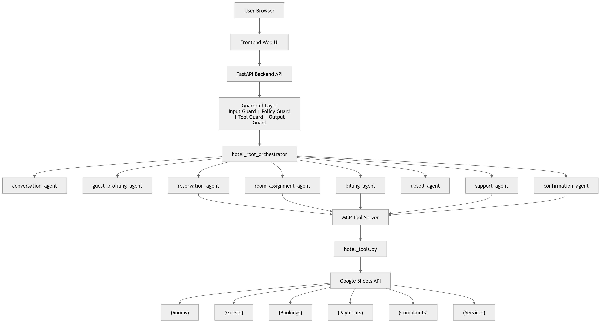
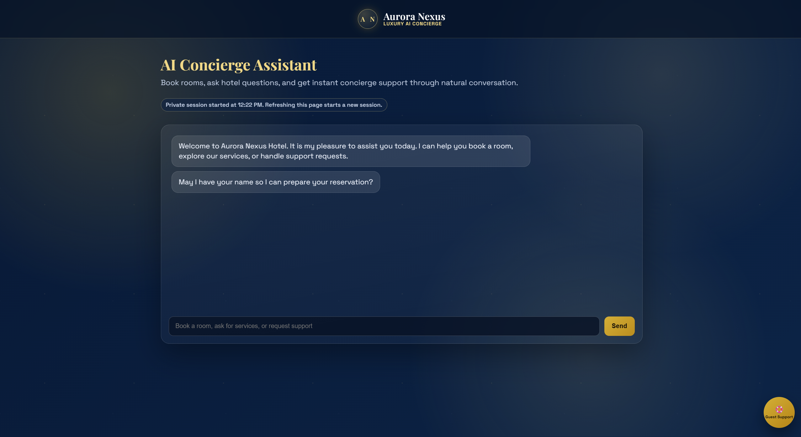
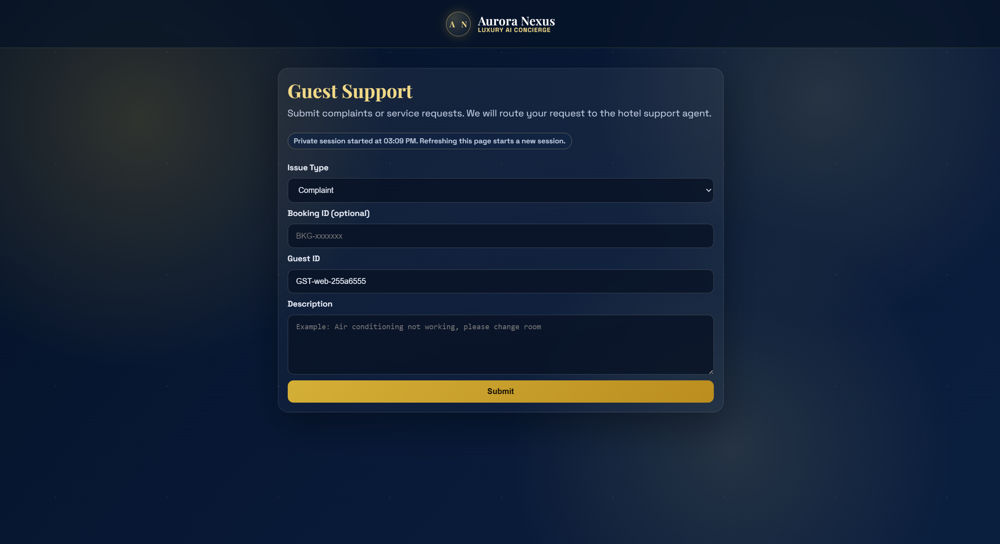

# Aurora Nexus AI Concierge

An agentic hotel concierge platform that automates booking, payment, support, and post-booking service workflows using FastAPI, Google ADK, MCP tools, and Google Sheets.

## Project Name

Aurora Nexus AI Concierge

This project delivers a stage-aware hotel operations assistant that coordinates booking, payment, support, and post-booking services through a multi-agent orchestration architecture.

## Project Overview

Aurora Nexus is a multi-agent hotel operations system that handles guest conversations end to end:

- captures guest intent and profile context
- recommends available rooms based on constraints
- enforces stage-safe booking and payment flow
- handles complaint/support scenarios
- supports post-confirmation service requests (upsell)

The system solves a common hospitality problem: fragmented manual workflows across front desk, reservation, billing, and support. By using specialized agents with strict guardrails and controlled tool access, it reduces workflow errors while maintaining a natural guest experience.

## System Architecture

End-to-end flow:

`User -> Frontend -> FastAPI Backend -> Gaurdrail Layer Agent -> Google ADK Agents -> MCP Tools -> Google Sheets`



### Layer Breakdown

- Frontend (`frontend/`): Web chat and support UI served directly by FastAPI.
- FastAPI backend (`main.py`, `api/`): Orchestrates stage transitions, validation, and API contracts.
- Google ADK agents (`agents/`, `orchestrator/`): Routes intent to specialized agents.
- MCP tool server (`tools/mcp_server.py`): Controlled tool execution surface for data operations.
- Google Sheets database (`tools/sheets_client.py`): Lightweight operational data store for rooms, bookings, payments, and services.
- Guardrails (`guardrails/`, `core/guardrail_manager.py`): Input, policy, tool, and output protections.

## Technology Stack

- Python
- FastAPI
- Uvicorn
- Google Gemini (`gemini-2.0-flash` by default)
- Google Agent Development Kit (ADK)
- FastMCP (MCP tool server)
- Google Sheets API (`gspread`)
- JavaScript/HTML/CSS frontend
- Pytest

## Multi-Agent System

Aurora Nexus uses role-specialized agents with controlled responsibilities and tool scope:

- Orchestrator Agent: stage-aware routing and handoff coordination.
- Conversation Agent: natural dialogue and general intent clarification.
- Guest Profiling Agent: extracts and confirms guest profile fields.
- Reservation Agent: availability and booking decision support.
- Room Assignment Agent: room selection, assignment checks, and continuity.
- Billing Agent: payment workflow and amount validation.
- Upsell Agent: optional add-on services after booking.
- Support Agent: complaint handling and recovery path.
- Confirmation Agent: final booking confirmation formatting and completion response.

This separation improves reliability, observability, and policy enforcement.

## Agent Profiles (A2A Flow)

The system applies an agent-to-agent (A2A) handoff pattern where the orchestrator delegates each step to a specialized agent and receives structured outcomes before moving to the next stage.

### A2A Stage Flow

1. Conversation Agent receives the user request and determines intent.
2. Guest Profiling Agent extracts guest profile fields and missing information.
3. Reservation Agent and Room Assignment Agent coordinate recommendation and room selection.
4. Billing Agent validates payment context and records transaction.
5. Confirmation Agent composes the final confirmed booking response.
6. Upsell Agent and Support Agent handle post-booking service requests and complaints.

### Handoff Principle

- Each agent owns a narrow responsibility.
- Tool access is policy constrained per role.
- Stage transitions only occur when prerequisite stage outputs are valid.

## API Endpoints

Main backend workflow endpoints:

- `POST /chat`: primary conversational endpoint with stage-aware orchestration.
- `GET /rooms`: fetches available room options from active constraints.
- `POST /booking/preview`: validates selected room and prepares booking preview.
- `POST /booking/preview/cancel`: rolls flow back from preview stage.
- `POST /booking`: creates booking and transitions to payment stage.
- `POST /payment/preview`: computes/returns payable amount for active booking.
- `POST /payment/cancel`: returns flow from payment stage to preview.
- `POST /payment`: records payment and transitions to confirmation stage.
- `POST /complaint`: logs complaint and supports resolution flow.

Utility endpoint:

- `GET /health`: service health status.

## Project Structure

```text
Final/
├── agents/
├── api/
├── core/
├── tools/
├── guardrails/
├── frontend/
├── observability/
├── orchestrator/
├── tests/
├── app/                      # Optional Laravel scaffold (secondary UI path)
├── main.py
├── requirements.txt
├── render.yaml
├── .env.example
└── README.md
```

## Local Development Setup

### 1. Clone Repository

```bash
git clone https://github.com/shawnsoclever/aurora-nexus-ai-concierge.git
cd aurora-nexus-ai-concierge
```

### 2. Create Virtual Environment and Install Dependencies

Windows PowerShell:

```powershell
python -m venv venv
.\venv\Scripts\activate
python -m pip install -r requirements.txt
```

macOS/Linux:

```bash
python -m venv venv
source venv/bin/activate
pip install -r requirements.txt
```

### 3. Configure Environment Variables

Copy and edit environment file:

```bash
cp .env.example .env
```

Set at minimum:

- `GOOGLE_API_KEY`
- `GOOGLE_MODEL=gemini-2.0-flash`
- `GOOGLE_SHEETS_SPREADSHEET_ID`
- `MCP_SERVER_URL=http://localhost:8080/mcp`

Google Sheets credentials options:

- local file mode: set `GOOGLE_SHEETS_CREDENTIALS_FILE`
- secret mode: set `GOOGLE_SHEETS_CREDENTIALS_JSON_B64`

### 4. Start MCP Server

```bash
python tools/mcp_server.py
```

### 5. Start FastAPI Server

```bash
uvicorn main:app --host 0.0.0.0 --port 8000 --reload
```

### 6. Run Tests

```bash
pytest -q
```

## Setup Instruction (Quick Start)

1. Clone repository and enter project root.
2. Create and activate virtual environment.
3. Install dependencies from `requirements.txt`.
4. Configure `.env` from `.env.example`.
5. Start MCP server (`python tools/mcp_server.py`).
6. Start FastAPI server (`uvicorn main:app --host 0.0.0.0 --port 8000 --reload`).
7. Open `/` for chat UI and run booking workflow.
8. Run tests with `pytest -q`.

## Deployment Guide (Render)

This project is best deployed as two Render services:

- Service A: FastAPI web service
- Service B: MCP web service

### Step 1 - Push Project to GitHub

```bash
git init
git add .
git commit -m "deploy aurora nexus"
git branch -M main
git remote add origin https://github.com/<your-repo>.git
git push -u origin main
```

### Step 2 - Create Render Services

1. Go to [https://render.com](https://render.com)
2. Connect your GitHub repository
3. Create two services from the same repo

### Step 3 - Configure Build Command

```bash
pip install -r requirements.txt
```

### Step 4 - Configure Start Commands

FastAPI service:

```bash
uvicorn main:app --host 0.0.0.0 --port $PORT
```

MCP service:

```bash
python tools/mcp_server.py
```

### Step 5 - Add Environment Variables

Common required variables:

- `GOOGLE_API_KEY`
- `GOOGLE_MODEL=gemini-2.0-flash`
- `GOOGLE_SHEETS_SPREADSHEET_ID`
- `GOOGLE_SHEETS_CREDENTIALS_JSON_B64`
- `APP_ENV=production`
- `LOG_LEVEL=INFO`

FastAPI service specific:

- `MCP_SERVER_URL=https://<your-mcp-service-url>/mcp`

### Step 6 - Deploy

Deploy MCP service first, then FastAPI service. After the MCP URL is available, set `MCP_SERVER_URL` on FastAPI and redeploy FastAPI.

### Optional: Use `render.yaml`

This repository already includes `render.yaml` to bootstrap both services.

## Usage

Typical user journey:

1. Open deployed website.
2. Start chat with concierge.
3. Provide stay details (dates, room type, guest count).
4. Review room recommendations.
5. Select room and review booking preview.
6. Proceed through payment preview and payment.
7. Receive final booking confirmation.
8. Request add-on services or submit complaints if needed.

## Webpage Explanation

Aurora Nexus provides a web-based interface served directly by FastAPI from the `frontend/` directory.

### Main Pages

- `/` (Chat Concierge Page)
	- Primary user interface for hotel booking conversation.
	- Captures guest requests and displays assistant responses in a chat flow.
	- Supports booking journey from intent capture to recommendation, preview, payment, and confirmation.



- `/support` (Support and Complaint Page)
	- Dedicated support interface for post-booking issues.
	- Allows guests to submit complaints tied to booking context.
	- Integrates with support/room-reassignment logic handled by backend tools.



### Frontend Behavior

- The webpage sends requests to FastAPI endpoints such as `/chat`, `/rooms`, `/booking/preview`, `/booking`, `/payment/preview`, `/payment`, and `/complaint`.
- UI state follows backend stage transitions to keep the workflow consistent.
- Booking confirmations and service responses are rendered directly in the chat interface.

### UI Implementation Files

- `frontend/index.html`: main concierge webpage structure.
- `frontend/chat.js`: chat interactions, booking actions, and API calls.
- `frontend/support.html`: support page structure.
- `frontend/support.js`: complaint submission interactions.
- `frontend/styles.css`: shared styling and responsive layout.

## Agentic Agency and Recovery

Aurora Nexus is designed to recover gracefully from model, policy, and stage-flow failures while preserving session continuity.

### Recovery Behaviors

- Stage enforcement prevents invalid jumps (for example confirmation before payment).
- Deterministic fallback responses are used for critical post-payment confirmations.
- Service and complaint intents in confirmation stage can be handled without relying on fragile free-form model behavior.
- New reservation intents after confirmation reset to recommendation stage safely.

### Failure Handling

- Validation errors return structured API error payloads with reason codes.
- Guardrail blocks provide explicit decision metadata.
- Runtime model errors are contained and surfaced as controlled backend responses.

### Reasoning Traces and Observability

- Correlation IDs are generated per workflow request.
- Audit logs track stage actions and outcomes.
- Guardrail decisions are logged for input, policy, tool, and output phases.

## Technical Depth (ADK and MCP Implementation)

This implementation demonstrates deep integration of Google ADK orchestration and MCP tool execution:

- ADK multi-agent composition with a root orchestrator and specialist sub-agents.
- MCP tool server exposing domain operations (booking, payment, room, services, support).
- Tool calls guarded by policy and payload checks before execution.
- Session-aware workflow state persisted and enforced at API layer.
- FastAPI endpoints mapped directly to stage transition contracts.

### Implementation Highlights

- `agents/` defines role-specific ADK agents.
- `orchestrator/runner.py` executes routed agent flows.
- `tools/mcp_server.py` hosts MCP tools over HTTP transport.
- `api/routes.py` enforces workflow transitions and deterministic fallbacks.
- `core/session.py` tracks session stage, preview state, and confirmation context.

## Security and Guardrails

The platform enforces multi-layer safety controls:

- Prompt injection detection at input stage.
- Role-based tool access policy checks.
- Tool payload validation before MCP execution.
- Output sanitization and redaction controls.
- Workflow stage enforcement to prevent invalid transitions.

Guardrail pipeline:

`Input Guard -> Policy Guard -> Tool Guard -> Output Guard`

## System Robustness (Safety Guardrails and ADK Controls)

The system robustness model combines ADK orchestration constraints with explicit guardrail and API-stage protections.

### Methods Implemented

- Input Safety Guard: checks user messages for unsafe content before agent execution.
- Policy Guard: validates whether the selected agent/tool action is allowed for the current intent and stage.
- Tool Guard: validates payload correctness and blocks unsafe tool operations.
- Output Guard: sanitizes sensitive text patterns in outbound responses.
- Stage Guardrails: API transition checks ensure order:
	- recommendation -> preview -> booking -> payment -> confirmation
	- cancellation routes return to safe prior stages

### Robustness Outcome

- Reduced risk of tool misuse and prompt injection.
- Reduced stage-skipping and inconsistent booking state.
- Improved reliability under model quota/runtime failures using deterministic fallbacks for critical paths.

## Future Improvements

- Real payment gateway integration.
- Persistent session store (for example Redis or database-backed sessions).
- Admin dashboard for bookings, support, and audit trails.
- Multi-language guest support.
- Advanced guardrails with richer anomaly detection and policy analytics.

## License

This project is released under the MIT License.

If you have not added a license file yet, create `LICENSE` with the MIT template.
